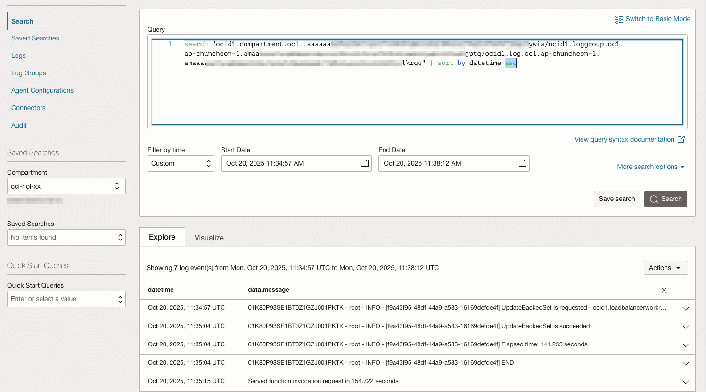

# oci-compute-handle-lb-backend-on-scale-event

OCI Compute Instance Pool을 사용하여, 오토 스케일을 할때 발생하는 이벤트에 대해 Load Balancer에 Backend로 등록하는 부분을 OCI Function으로 처리한 예시입니다.

## 사전 구성할 것

- Instance Pool 구성
    - Instance Pool 생성시 *Attach a load balancer* 체크하시 않음
    - 이미 Attach 한 경우, Network 탭에서 *Detach Load Balancer* 선택
- autoscaling configuration을 구성

- 테스트용 VM 예시

    1. Apache HTTP Server의 Custom Image 만들기

        ```
        #!/bin/bash
        sudo yum -y install httpd
        sudo firewall-offline-cmd --add-port=80/tcp
        ```

    2. instance configuration의 cloud-init 예시

        ```
        #!/bin/bash
        echo sleep 1m
        sleep 1m
        MY_IP=$(hostname -I)
        sudo bash -c "echo 'Hello Apache on '$MY_IP >> /var/www/html/index.html"
        sudo bash -c "echo '<b>'$MY_IP'</b>' >> /var/www/html/index.html"
        sudo systemctl start httpd
        sudo systemctl enable httpd
        ```

## OCI Function 배포 구성

### Application 생성

1. OCI 콘솔에 로그인합니다.

2. [OCI Functions - Application](https://cloud.oracle.com/functions/apps) 화면으로 이동합니다.

3. application을 생성합니다.

    - Name: 'oci-hol-fn-app`
    - VCN, Subnet 지정
    - Shape: `GENERIC_X86`

4. 생성한 application으로 이동합니다.

5. Monitoring 탭에서 Function Invocation Logs를 활성화합니다.

### fn cli 설정

application의 상세페이지 Getting started에 있는 Cloud shell setup 또는 Local setup을 따라. fn cli를 설정합니다.


## OCI Function 배포

1. 배포할 OCI Function 코드를 복제합니다.

    ```
    git clone https://github.com/TheKoguryo/oci-functions-demos.git
    cd oci-functions-demos
    cd oci-compute-handle-lb-backend-on-scale-event
    ```

2. `func.yaml`의 config에서 `LOAD_BALANCER_ID`, `BACKEND_SET_NAME`을 사용할 OCI Load Balancer의 정보로 업데이트 합니다.
Backend Heath Check 정보도 기본 값과 다른 경우 변경합니다.

    ```
    schema_version: 20180708
    name: oci-compute-handle-lb-backend-on-scale-event
    ...
    config:
      BACKEND_SET_NAME: test-lb-bs...
      HEALTH_CHECK_INTERVAL_MS: "10000"
      HEALTH_CHECK_MAX_RETRIES: "100"
      HEALTH_CHECK_PORT: "80"
      HEALTH_CHECK_PROTOCOL: HTTP
      HEALTH_CHECK_STATUS_CODE: "200"
      HEALTH_CHECK_TIMEOUT_MS: "3000"
      HEALTH_CHECK_URL_PATH: /
      LOAD_BALANCER_ID: ocid1.loadbalancer.oc1...
    ``` 

3. function을 배포합니다.

   ```
   fn deploy --app oci-hol-fn-app
   ```

## OCI Events 서비스 Rule 설정

1. OCI 콘솔에 로그인합니다.

2. [OCI Events - Rules](https://cloud.oracle.com/events/rules) 화면으로 이동합니다.

3. Create Rule을 클릭합니다.

4. Display Name에 원하는 이름을 입력합니다.

    - Display Name: 예, instancepool-backendset-sync-rule

5. 이벤트가 트리거되는 조건(Rule Conditions)으로 autoscale 되어, Instance Pool의 업데이트가 시작하는 이벤트로 지정합니다

    | Condition  | Event Type | Service Name                   |
    |------------|------------|--------------------------------|
    | Event Type | Compute    | `Instance Pool - Update Begin` |

6. 트리거되면 실행한 액션을 앞서 배포한 function으로 지정합니다.

    | Action Type | Function Compartment | Function Application | Function                                       |
    |-------------|----------------------|----------------------|------------------------------------------------|
    | Functions   | [compartment-name]   | oci-hol-fn-app       | `oci-compute-handle-lb-backend-on-scale-event` |

## 배포한 OCI Function에 필요한 IAM 권한

이벤트 발생시 실행되는 배포된 function는 동작하기 위해 OCI 자원을 조회하고, LB BacknedSet에 새 Compute 인스턴스를 Backend로 추가하거나, 삭제할 권한이 필요합니다. 관련 권한을 OCI IAM Policy로 부여합니다.

1. OCI 콘솔에 로그인합니다.

2. [OCI Identity - Policies](https://cloud.oracle.com/identity/domains/policies) 화면으로 이동합니다.

3. Policy를 생성합니다.

    - Name: for-oci-functions

    - Description: for-oci-functions

    - Rule: [compartment-name]을 Instance Pool 및 Function이 있는 Compartment로 지정합니다.

        ```
        Allow any-user to read vnic-attachments in compartment [compartment-name] where all {request.principal.type='fnfunc'}
        Allow any-user to inspect vnics in compartment [compartment-name] where all {request.principal.type='fnfunc'}
        Allow any-user to use instances in compartment [compartment-name] where all {request.principal.type='fnfunc'}
        Allow any-user to use load-balancers in compartment [compartment-name] where all {request.principal.type='fnfunc'}
        Allow any-user to read instance-pools in compartment [compartment-name] where all {request.principal.type='fnfunc'}
        Allow any-user to inspect work-requests in compartment [compartment-name] where all {request.principal.type='fnfunc'}
        Allow any-user to manage instance-pools in compartment [compartment-name] where all {request.principal.type='fnfunc', request.operation='GetWorkRequest'}
        ```

## 실행

OCI Load Balancer를 통해 Instance Pool에 부하를 주어, 오토스케일이 일어나게 합니다.

또는 테스트를 위해 Instance Pool내 Compute 인스턴스에 직접 ssh로 접속하여 부하를 주거나, Instance Pool의 Target Instance Count를 직접 조정합니다.

### 결과 확인

Application의 Monitoring 탭에서 지정한 OCI Logging으로 이동합니다. 기본 검색 또는 고급 검색을 통해 실행 로그를 확인합니다. 약간의 지연이 있을 수 있습니다.



## 추가 변경

### 컨테이너 이미지 위치 변경

Function 배포시 생성되는 컨테이너 이미지는 OCI Registry에 푸쉬됩니다. 해당 이름의 Repository가 없는 경우, Root compartment에 이미지가 푸쉬됩니다. 아래와 같이 확인하여 compartment를 이동합니다.

1. OCI 콘솔에 로그인합니다.

2. [OCI Registry](https://cloud.oracle.com/compute/registry/containers)로 이동합니다.

3. 생성된 Repository와 이미지를 확인합니다.

    - Repostory Name: 예, oci-hol-xx/oci-hol-fn-app/oci-compute-handle-lb-backend-on-scale-event

4. Move compartment를 클릭하여, function이 있는 compartment로 이동시킵니다. 이후 function을 재배포하면 이미 있는 Repository를 사용합니다.

### config 설정값 변경

1. [OCI Functions - Application](https://cloud.oracle.com/functions/apps) 화면으로 이동합니다.

2. 사용하는 Application을 클릭하고, Functions 탭에서 대상 function을 클릭합니다.

3. Configuration 탭으로 이동하면, 앞서 배포시 `func.yaml`의 config에서 설정한 값을 변경하여 적용 할 수 있습니다.

### 타임아웃 설정 변경

동기성 OCI Function의 실행 타임아웃은 최대 300초(5분)입니다. 시간을 초과하면, 실행 중 종료됩니다.
Backend VM의 기동시간이 더 긴 경우, 더 긴 타임아웃 설정이 필요하면, Detach 모드로 실행해야 합니다. 이때는 타임아웃이 최대 1시간으로 늘어납니다.

1. Function의 화면에서 오른쪽 위에 Edit 버튼을 클릭합니다. 사전에 컨테이너 이미지 위치 변경를 Function과 동일 위치로 변경합니다.

2. 아래쪽 Detached invocation configuration 설정에서 Detached invocation timeout (in seconds) 값을 원하는 값으로 변경합니다.

### Cold Start 방지

1. Function의 화면에서 오른쪽 위에 Edit 버튼을 클릭합니다. 사전에 컨테이너 이미지 위치 변경를 Function과 동일 위치로 변경합니다.

2. 아래쪽 Provisioned concurrency 설정에서 Enable provisioned concurrency을 활성화합니다. 이때는 Provisioned concurrency units (PCUs)에 따라 최소 서버가 실행중인 상태로 Function이 실행되지 않더라도, PCU에에 대한 비용이 발생합니다.
