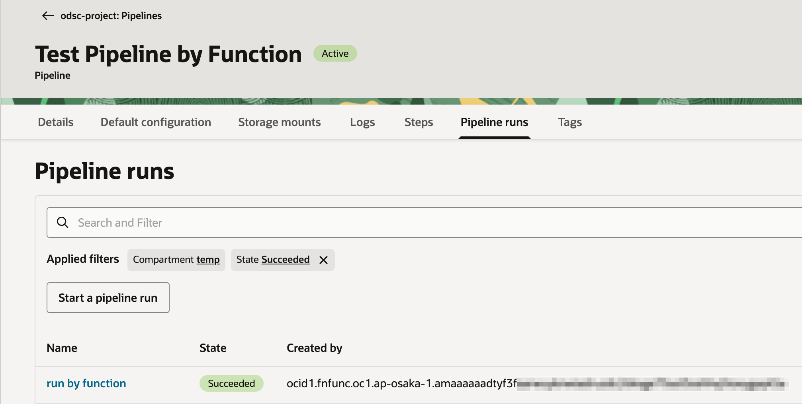
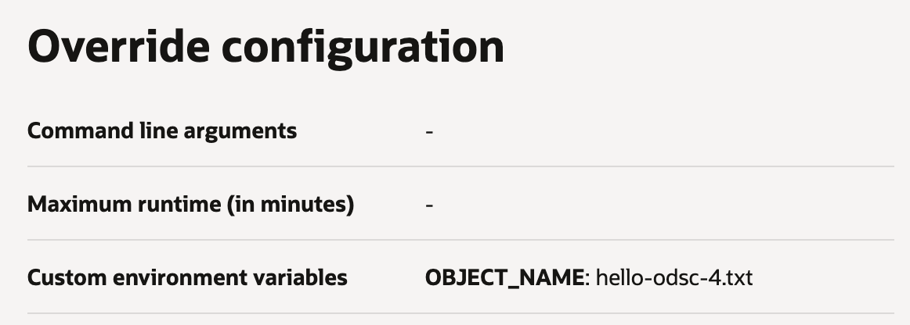

# oci-datascience-run-pipeline-on-object-event

OCI Object Storage Bucket에 오브젝트가 업로드 되었을 때, 해당 이벤트로 OCI Data Science 파이프라인을 실행하는 것을 OCI Functions으로 처리한 예시입니다. 단순히 실행하는 것까지만 확인하는 예제입니다.

## 사전 구성할 것

- OCI Object Storage Bucket 생성

    - Name: 예, `pipeline-input-bucket`
    - Emit object events: Event 생성을 위해 활성화

- OCI Data Science 파이프라인 생성

    1. Notebook Session 생성후 오픈

    2. Notebook Session에서 Terminal 실행

    3. 파이프라인에서 실행할 스크립트(script.py) 파일 생성 - 실행이 되고, 파라미터를 넘겨받을 수 있는지만 체크하기 위한 스크립트

        ```
        # script.py
        import os

        print("Pipeline script step started")

        object_name = os.getenv("OBJECT_NAME")
        print(f"object_name: {object_name}")
        ```

    4. Terminal에서 OCI SDK 실행을 위한 [OCI Config](https://docs.oracle.com/en-us/iaas/Content/API/Concepts/sdkconfig.htm) 설정후 동작하는 지 확인

        ```
        oci os ns get
        ```

    5. Terminal에서 python 실행후 다음 복사해서 실행 - [Data Science Pipeline - Quick Start](https://accelerated-data-science.readthedocs.io/en/stable/user_guide/pipeline/quick_start.html)를 참고하여 수정한 샘플 코드

        ```
        from ads.pipeline import Pipeline, PipelineStep, CustomScriptStep, ScriptRuntime, NotebookRuntime
        import os

        infrastructure = (
            CustomScriptStep()
            .with_block_storage_size(50)
            .with_shape_name("VM.Standard.E4.Flex")
            .with_shape_config_details(ocpus=2, memory_in_gbs=16)
        )

        script_runtime = (
            ScriptRuntime()
            .with_source("script.py")
            .with_service_conda("generalml_p311_cpu_x86_64_v5")
        )

        pipeline_step_1 = (
            PipelineStep("step_1")
            .with_description("A step running a python script")
            .with_infrastructure(infrastructure)
            .with_runtime(script_runtime)
        )

        compartment_id = os.environ['NB_SESSION_COMPARTMENT_OCID']
        project_id = os.environ["PROJECT_OCID"]

        print(compartment_id)
        print(project_id)

        pipeline = (
            Pipeline("Test Pipeline by Function")
            .with_compartment_id(compartment_id)
            .with_project_id(project_id)
            .with_step_details([pipeline_step_1])
        )

        pipeline.create()

        pipeline.compartment_id
        pipeline.project_id
        pipeline.id
        ```

    6. 필요한 정보를 기록해 둡니다. 

        - compartment_id, project_id, pipeline.id

    7. OCI 콘솔에 로그인합니다. 생성된 파이프라인으로 이동합니다. 이름 예, Test Pipeline by Function

    8. 서비스 로그 활성화 - Logs탭에서 Pipeline Run Logs 로그를 활성화합니다.

    9. 파이프라인 로그 활성화 - 파이프라인 오른쪽 위 Edit를 클릭하여, Edit pipeline 화면으로 이동합니다. Logging configuration에서 Enable logging 활성화하고 저장합니다.

## OCI Function 배포 구성

### Application 생성

1. OCI 콘솔에 로그인합니다.

2. [OCI Functions - Application](https://cloud.oracle.com/functions/apps) 화면으로 이동합니다.

3. application을 생성합니다. 예제는 X86기준입니다.

    - Name: `oci-hol-fn-app`
    - VCN, Subnet 지정
    - Shape: `GENERIC_X86`

4. 생성한 application의 Monitoring 탭에서 Function Invocation Logs를 활성화합니다.

### fn cli 설정

application의 상세페이지(Details) 탭의 Getting started에 있는 Cloud shell setup 또는 Local setup을 따라 fn cli를 설정합니다.

Cloud shell을 사용하는 경우 왼쪽 Actions > Architecture를 클릭하여, `X86_64`로 변경합니다. 변경후 `echo $CPU_ARCHITECTURE`로 확인합니다.

## OCI Function 배포

1. 배포할 OCI Function 코드를 복제합니다.

    ```
    git clone https://github.com/TheKoguryo/oci-functions-demos.git
    cd oci-functions-demos
    cd oci-datascience-run-pipeline-on-object-event
    ```

2. `func.yaml`의 config에서 `ODSC_COMPARTMENT_ID`, `ODSC_PROJECT_ID`, `ODSC_PIPELINE_ID`를 호출할 사용할 OCI Data Science 파이프라인의 정보로 업데이트 합니다.

    ```
    schema_version: 20180708
    name: oci-datascience-run-pipeline-on-object-event
    ...
    config:
      ODSC_COMPARTMENT_ID: ocid1.compartment.oc1...
      ODSC_PROJECT_ID: ocid1.datascienceproject.oc1...
      ODSC_PIPELINE_ID: ocid1.datasciencepipeline.oc1...      
    ``` 

3. function을 배포합니다.

   ```
   fn deploy --app oci-hol-fn-app
   ```

## OCI Events 서비스 Rule 설정

1. OCI 콘솔에 로그인합니다.

2. [OCI Events - Rules](https://cloud.oracle.com/events/rules) 화면으로 이동합니다.

3. Create Rule을 클릭합니다.

4. Display Name에 원하는 이름을 입력합니다.

    - Display Name: 예, objectstorage-datascience-pipeline-run-rule

5. 이벤트가 트리거되는 조건(Rule Conditions)으로 autoscale 되어, Instance Pool의 업데이트가 시작하는 이벤트로 지정합니다

    | Condition  | Service Name   | Event Type              |
    |------------|----------------|-------------------------|
    | Event Type | Object Storage | `Object - Create`       |
    | Attribute  | bucketName     | `pipeline-input-bucket` |    

6. 트리거되면 실행한 액션을 앞서 배포한 function으로 지정합니다.

    | Action Type | Function Compartment | Function Application | Function                                       |
    |-------------|----------------------|----------------------|------------------------------------------------|
    | Functions   | [compartment-name]   | oci-hol-fn-app       | `oci-datascience-run-pipeline-on-object-event` |

## 배포한 OCI Function에 필요한 IAM 권한

이벤트 발생시 실행되는 배포된 function는 동작하기 위해 OCI 자원을 조회하고, OCI Data Science 파이프라인을 실행하는 권한이 필요합니다. 관련 권한을 OCI IAM Policy로 부여합니다.

1. OCI 콘솔에 로그인합니다.

2. [OCI Identity - Policies](https://cloud.oracle.com/identity/domains/policies) 화면으로 이동합니다.

3. Policy를 생성합니다.

    - Name: for-oci-functions

    - Description: for-oci-functions

    - Rule: [compartment-name]을 Pipeline 및 Function이 있는 Compartment로 지정합니다.

        ```
        Allow any-user to read objects in compartment [compartment-name] where all {request.principal.type='fnfunc', target.bucket.name='pipeline-input-bucket'}
        Allow any-user to read data-science-projects in compartment [compartment-name] where all {request.principal.type='fnfunc'}
        Allow any-user to read data-science-pipelines in compartment [compartment-name] where all {request.principal.type='fnfunc'}
        Allow any-user to manage data-science-pipeline-runs in compartment [compartment-name] where all {request.principal.type='fnfunc'}
        Allow any-user to read log-groups in compartment [compartment-name] where all {request.principal.type='fnfunc'}
        Allow any-user to manage log-groups in compartment [compartment-name] where all {request.principal.type='fnfunc'}
        Allow any-user to use object-family in compartment [compartment-name] where ALL { request.principal.type = 'datasciencepipelinerun' }
        Allow any-user to use virtual-network-family in compartment [compartment-name] where ALL { request.principal.type = 'datasciencepipelinerun' }
        Allow any-user to use log-content in compartment [compartment-name] where ALL { request.principal.type = 'datasciencepipelinerun' }        
        ```

## 실행

이벤트 발생을 위해 Object Storage Bucket에 새 파일을 업로드합니다.

### 결과 확인

1. 파이프 라인 실행 목록에서 function이 호출한 것을 확인합니다.

    

2. 해당 실행건을 클릭합니다. Pipeline run override 탭에서 Function에 호출시 넘이 오브젝트 이름이 환경변수로 넘어간 걸 확인합니다.

    

3. Details 탭으로 이동하여, 실행 로그 링크를 클릭합니다. 이동한 OCI Logging 페이지에서 파이프파인 실행로그 중 스크립트에서 출력한 오브젝트 이름을 확인합니다.

    

## 추가 변경

### config 설정값 변경

1. [OCI Functions - Application](https://cloud.oracle.com/functions/apps) 화면으로 이동합니다.

2. 사용하는 Application을 클릭하고, Functions 탭에서 대상 function을 클릭합니다.

3. Configuration 탭으로 이동하면, 앞서 배포시 `func.yaml`의 config에서 설정한 값을 변경하여 적용 할 수 있습니다.
