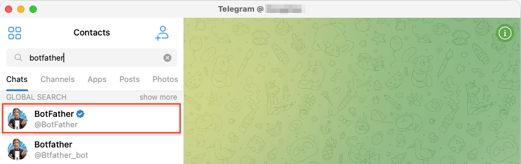
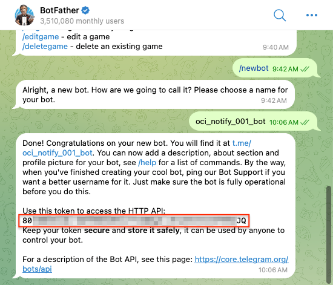
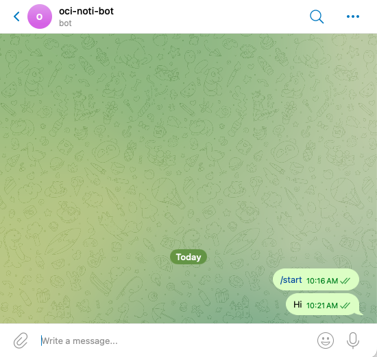
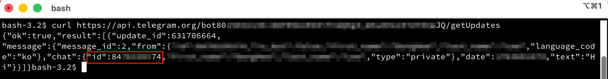
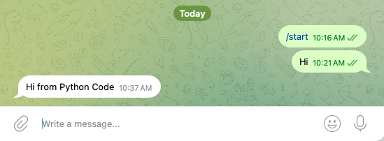
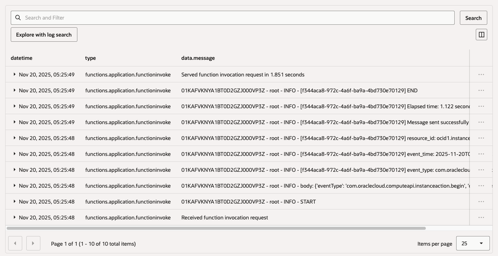
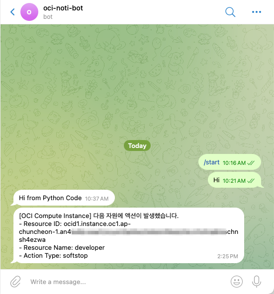

# oci-notification-telgram-forwarder

요건에 따라 구성은 달라질수 있습니다. 여기서는 Notification Topic -> Telegram 직접 구성이 되지 않아,
OCI Notification Topic에 전달된 메시지를 OCI Function을 통해 Telegram 메시지로 전달하는 예시입니다.

## 사전 구성할 것

### 채팅할 Telegram 정보 구하기

1. Telegram에 로그인합니다.

2. `botfather`로 검색합니다. 4글자이상 입력하면 검색결과가 보입니다. 체크 표시가 있는 공식 BotFather를 선택합니다.

    

3. Start를 클릭하여 대화를 시작합니다.

4. `/newbot` 메시지를 전송합니다. Bot의 이름을 정해줍니다. `-`은 안되고 `_`는 됩니다. bot으로 끝나야 합니다. 규칙에 맞지 않거나, 이미 있는 이름인 경우, 다시 입력하라고 합니다.

    

5. Bot이 생성되면, 사용 설명 메시지에서 HTTP API 접근을 위한 token을 알려줍니다. token을 기록해 둡니다.

6. t.me/로 시작하는 링크를 클릭하여, 생성된 Bot으로 이동하여, Start를 클릭하여 대화를 시작합니다.

7. 아무 메시지나 전송합니다.

    

8. 메시지 전송직후 다음 명령을 실행하고, 응답 메시지에서 result[0].chat.id를 확인합니다. 여기서는 84xxxxxx74

    ```
    curl https://api.telegram.org/bot{$token}/getUpdates
    ```

    

9. Telegram Bot과 API로 대화할수 있는 token과 chat_id가 준비되었습니다.

10. Python Code에서 전송 테스트를 합니다.

    - 라이브러리를 설치합니다.

        ```bash
        pip install python-telegram-bot
        ```

    - 다음 코드를 작성하여 실행합니다.

        ```python
        import telegram
        import asyncio

        BOT_TOKEN = "80xxxxxxxxxxxxxxxxxxxxxxxxxxxxxxxxxxxxxxxxxxJQ"
        CHAT_ID= "84xxxxxx74"

        async def send_telegram_message(message_text):
            bot = telegram.Bot(token=BOT_TOKEN)
            try:
                await bot.sendMessage(chat_id=CHAT_ID, text=message_text)
                print(f"Message sent successfully to chat ID {CHAT_ID}")
            except Exception as e:
                print(f"Error sending message: {e}")

        if __name__ == "__main__":
            message_to_send = "Hi from Python Code"
            asyncio.run(send_telegram_message(message_to_send))
        ```

11. 테스트 완료

    


## OCI Function 배포 구성

### Application 생성

1. OCI 콘솔에 로그인합니다.

2. [OCI Functions - Application](https://cloud.oracle.com/functions/apps) 화면으로 이동합니다.

3. application을 생성합니다.

    - Name: 'oci-hol-fn-app`
    - VCN, Subnet 지정
    - Shape: `GENERIC_X86`

4. 생성한 application으로 이동합니다.

5. Monitoring 탭에서 Function Invocation Logs를 활성화합니다.

### fn cli 설정

application의 상세페이지 Getting started에 있는 Cloud shell setup 또는 Local setup을 따라. fn cli를 설정합니다.


## OCI Function 배포

1. 배포할 OCI Function 코드를 복제합니다.

    ```
    git clone https://github.com/TheKoguryo/oci-functions-demos.git
    cd oci-functions-demos
    cd oci-notification-telegram-forwarder
    ```

2. `func.yaml`의 config에서 `BOT_TOKEN`, `CHAT_ID`을 사용할 Telegram의 정보로 업데이트 합니다.
Backend Heath Check 정보도 기본 값과 다른 경우 변경합니다.

    ```
    schema_version: 20180708
    name: oci-notification-telegram-forwarder
    ...
    config:
      BOT_TOKEN: 80xxx
      CHAT_ID: "84xxx
    ``` 

3. 요건에 따라 func.py 등 코드를 변경합니다.

4. function을 배포합니다.

   ```
   fn deploy --app oci-hol-fn-app
   ```

## OCI Notification Topic 생성

1. OCI 콘솔에 로그인합니다.

2. [OCI Notifications - Topics](https://cloud.oracle.com/notification/topics) 화면으로 이동합니다.

3. Create topic을 클릭합니다.

4. Name에 원하는 이름을 입력합니다.

    - Name: 예, demo-notification-topic


## OCI Events 서비스 Rule 설정 (예시)

OCI Events에서 OCI Function을 직접 호출할 수 있지만, 요건에 따라 Notification Topic을 거치게 구성하였습니다.

1. OCI 콘솔에 로그인합니다.

2. [OCI Events - Rules](https://cloud.oracle.com/events/rules) 화면으로 이동합니다.

3. Create Rule을 클릭합니다.

4. Display Name에 원하는 이름을 입력합니다.

    - Display Name: 예, instance-event-rule

5. 이벤트가 트리거되는 조건(Rule Conditions)을 지정합니다

    | Condition  | Event Type | Service Name                   |
    |------------|------------|--------------------------------|
    | Event Type | Compute    | `Instance - Action Begin`      |

6. 트리거되면 실행한 액션을 앞서 배포한 function으로 지정합니다.

    | Action Type   | Notifications Compartment | Topic                    |
    |---------------|---------------------------|--------------------------|
    | Notifications | [compartment-name]        | demo-notification-topic  |

## 실행

현재 있는 Compute VM을 시작 또는 종료하여 `Instance - Action Begin`를 발생시킵니다.

### 결과 확인

1. Application의 Monitoring 탭에서 지정한 OCI Logging으로 이동합니다. 기본 검색 또는 고급 검색을 통해 실행 로그를 확인합니다. 약간의 지연이 있을 수 있습니다.

    

2. Telegram에서 Bot에서 온 메시지를 확인합니다.

    

## 추가 변경

### 컨테이너 이미지 위치 변경

Function 배포시 생성되는 컨테이너 이미지는 OCI Registry에 푸쉬됩니다. 해당 이름의 Repository가 없는 경우, Root compartment에 이미지가 푸쉬됩니다. 아래와 같이 확인하여 compartment를 이동합니다.

1. OCI 콘솔에 로그인합니다.

2. [OCI Registry](https://cloud.oracle.com/compute/registry/containers)로 이동합니다.

3. 생성된 Repository와 이미지를 확인합니다.

    - Repostory Name: 예, oci-hol-xx/oci-hol-fn-app/oci-notification-telegram-forwarder

4. Move compartment를 클릭하여, function이 있는 compartment로 이동시킵니다. 이후 function을 재배포하면 이미 있는 Repository를 사용합니다.

### config 설정값 변경

1. [OCI Functions - Application](https://cloud.oracle.com/functions/apps) 화면으로 이동합니다.

2. 사용하는 Application을 클릭하고, Functions 탭에서 대상 function을 클릭합니다.

3. Configuration 탭으로 이동하면, 앞서 배포시 `func.yaml`의 config에서 설정한 값을 변경하여 적용 할 수 있습니다.

### 타임아웃 설정 변경

동기성 OCI Function의 실행 타임아웃은 최대 300초(5분)입니다. 시간을 초과하면, 실행 중 종료됩니다.
Backend VM의 기동시간이 더 긴 경우, 더 긴 타임아웃 설정이 필요하면, Detach 모드로 실행해야 합니다. 이때는 타임아웃이 최대 1시간으로 늘어납니다.

1. Function의 화면에서 오른쪽 위에 Edit 버튼을 클릭합니다. 사전에 컨테이너 이미지 위치 변경를 Function과 동일 위치로 변경합니다.

2. 아래쪽 Detached invocation configuration 설정에서 Detached invocation timeout (in seconds) 값을 원하는 값으로 변경합니다.

### Cold Start 방지

1. Function의 화면에서 오른쪽 위에 Edit 버튼을 클릭합니다. 사전에 컨테이너 이미지 위치 변경를 Function과 동일 위치로 변경합니다.

2. 아래쪽 Provisioned concurrency 설정에서 Enable provisioned concurrency을 활성화합니다. 이때는 Provisioned concurrency units (PCUs)에 따라 최소 서버가 실행중인 상태로 Function이 실행되지 않더라도, PCU에에 대한 비용이 발생합니다.
